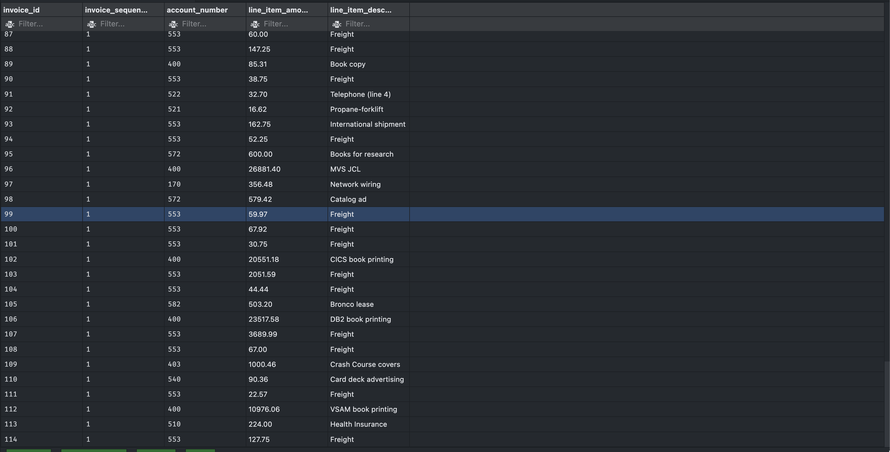

# DBA-120-OA1: Exam 1

## Exercise 1: [ch5_ex1.sql](ch5_ex1.sql)

```
INSERT INTO terms (terms_id, terms_description, terms_due_days)
VALUES ('6', 'Net due 120 days', '120');
```


---

## Exercise 2: [ch5_ex2.sql](ch5_ex2.sql)

```
UPDATE terms
SET terms_description = 'Net due 125 days',
  terms_due_days = '125'
WHERE terms_id = 6;
```


---

## Exercise 3: [ch5_ex3.sql](ch5_ex3.sql)

```
DELETE FROM terms
WHERE terms_id = 6
```


---

## Exercise 4: [ch5_ex4.sql](ch5_ex4.sql)

```
INSERT INTO invoices
VALUES (NULL, 32, 'AX-014-027', '2018-08-01', 434.58, 0.00, 0.00,2, '2018-08-31', null)
```


---

## Exercise 5: [ch5_ex5.sql](ch5_ex5.sql)

```
INSERT INTO invoice_line_items (invoice_id, invoice_sequence, account_number, line_item_amount, line_item_description)
VALUES
((SELECT MAX(invoice_id) FROM invoices), 1, 160, 180.23, 'Hard drive'),
((SELECT MAX(invoice_id) FROM invoices), 2, 527, 254.35, 'Exchange Server update');
```


---

## Exercise 6: [ch5_ex6.sql](ch5_ex6.sql)

```
UPDATE invoices
SET credit_total = invoice_total * 0.1,
    payment_total = invoice_total - credit_total
WHERE invoice_id = 115;
```


---

## Exercise 7: [ch5_ex7.sql](ch5_ex7.sql)

```
UPDATE vendors
SET default_account_number = 403
WHERE vendor_id = 44
```


---

## Exercise 8: [ch5_ex8.sql](ch5_ex8.sql)

```
UPDATE invoices
SET terms_id = 2
WHERE vendor_id in (
  SELECT vendor_id
  FROM vendors
  WHERE default_terms_id = 2);
```


---

## Exercise 9: [ch5_ex9.sql](ch5_ex9.sql)

```
DELETE FROM invoice_line_items
WHERE invoice_id = 115;
DELETE FROM invoices
WHERE invoice_id = 115;
```

### invoices Table


### invoice_line_items Table



---
